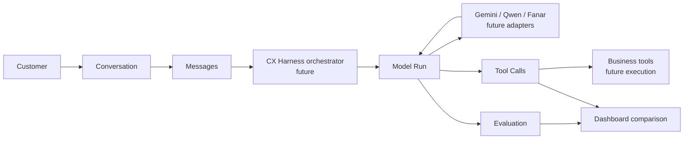

# AI Pipeline

[Project overview](PROJECT_OVERVIEW.md) · [Database](DATABASE_ARCHITECTURE.md) · [System architecture](SYSTEM_ARCHITECTURE.md)

> Status: the database and read-only observability surfaces exist. Live provider calls, tool execution, harness orchestration, and automatic evaluation generation are future implementation work.

## Diagram 10 — End-to-end customer experience flow

### Plain-English explanation

A customer starts a conversation and exchanges messages. In the future, the harness will send context to a selected model, record the run, audit requested tools, evaluate the response, and show results in the dashboard.

### Engineering explanation

`conversations` is the aggregate root for interaction history. Ordered `messages` provide context. `model_runs` stores provider, model, token, latency, cost, outcome, and timing telemetry. `tool_calls` stores JSONB input/output and execution state. `evaluations` stores evaluator identity, dimension scores, overall score, pass/fail, and details.

### Why this architecture

Recording execution and evaluation separately from message history enables reproducibility, fair provider comparisons, auditing, and future re-evaluation without changing the original conversation.

### Benefits

- Multiple runs per conversation
- Multiple evaluations per run
- Traceable tool activity
- Provider-neutral observability
- Dashboard-ready comparison data

### Tradeoffs

- More telemetry storage
- Correlation and timing rules must be enforced by future services
- Model quality depends on consistent prompts, tools, and evaluators
- Provider deployment choices remain unresolved

## Planned execution boundary

The future harness should depend on generic provider and business-tool interfaces. Provider-specific SDKs and adapters should be added only after deployment methods are selected. A Render-hosted backend cannot directly call an Ollama server running on a developer laptop; deployed open models require a reachable inference endpoint.

