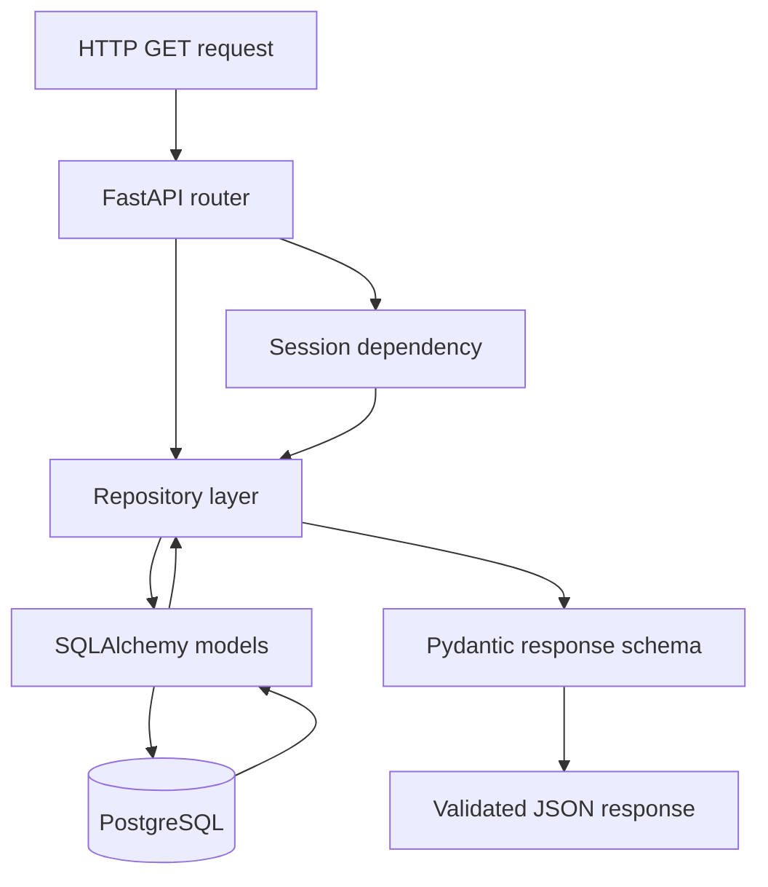
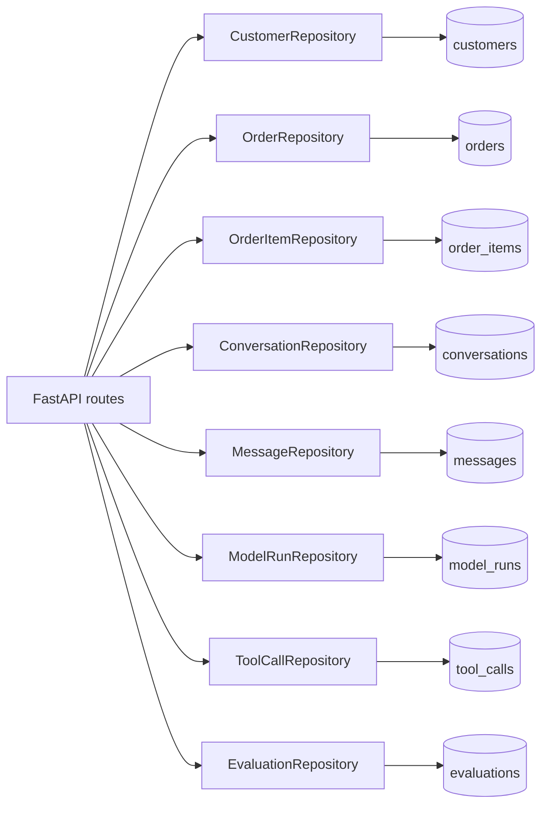

# Backend Architecture

[Project overview](PROJECT_OVERVIEW.md) · [Database](DATABASE_ARCHITECTURE.md) · [Data flow](DATA_FLOW.md)

## Diagram 5 — Backend layers

### Plain-English explanation

FastAPI receives a request, opens a database session, asks a repository for data, and returns validated JSON.

### Engineering explanation

Routers own HTTP concerns such as paths, parameters, status codes, and response models. Repositories own reusable query construction, validation, ordering, pagination, and eager loading. SQLAlchemy models map database tables and relationships. Pydantic schemas form a stable serialization boundary.

### Why repositories exist

Repositories prevent route functions from becoming query scripts. They make query behavior reusable, independently testable, deterministically ordered, and consistently validated.

### Why Pydantic exists

Pydantic verifies that outbound data matches the public API contract, converts UUID/Decimal/datetime values safely, and drives OpenAPI documentation.

### Why ORM models are not returned directly

Database models expose persistence details and relationships that should not automatically become public API. Returning explicit schemas prevents accidental fields, recursive serialization, and tight coupling between database and clients.

### Benefits

- Thin HTTP routes
- Testable query layer
- Stable public contracts
- Automatic Swagger and ReDoc documentation
- Consistent error handling

### Tradeoffs

- Similar fields appear in both ORM and Pydantic definitions
- New capabilities may require coordinated repository, schema, and route changes

## Diagram 6 — Repository overview

### Plain-English explanation

Each major table has one read-only repository responsible for listing, counting, finding, filtering, and loading related records.

### Engineering explanation

All repositories reuse shared pagination, filter validation, and `RepositoryValidationError` behavior. Commerce repositories serve customer/order data; CX repositories serve conversation/message data; telemetry repositories serve runs, calls, and evaluations.

### Why this architecture

Table-focused repositories match the current read-only API and keep domain query behavior discoverable.

### Benefits

- Predictable naming and behavior
- Focused integration tests
- No accidental writes
- Easier query performance review

### Tradeoffs

- Cross-domain analytics may eventually need dedicated reporting repositories or services
- A repository-per-aggregate adds files as the schema grows

