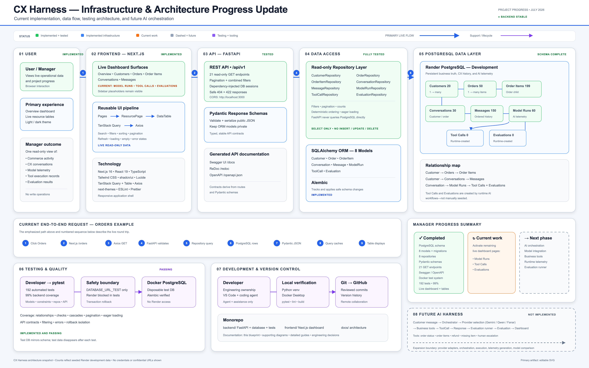

# CX Harness Master Infrastructure Blueprint

CX Harness is a read-only operational and AI-observability platform. Its implemented path moves live commerce, conversation, and model telemetry data from PostgreSQL through SQLAlchemy repositories, FastAPI, Axios, and TanStack Query into a reusable Next.js dashboard. The blueprint separates this stable foundation from the future AI orchestration, provider, business-tool, and evaluation runtime.

## Status legend

- **Green — Implemented and tested:** production-shaped features verified by the automated suite.
- **Blue — Implemented infrastructure:** active architecture and data-flow components.
- **Orange — Current work:** remaining live dashboard resource pages.
- **Purple — Testing and tooling:** isolated quality and development systems.
- **Gray dashed — Future:** deliberately unimplemented AI runtime capabilities.

## Architecture zones

1. **User and Frontend:** the manager-facing Next.js dashboard and reusable `ResourcePage` → `DataTable` → TanStack Query → Axios pipeline.
2. **API:** 21 read-only FastAPI endpoints, Pydantic response contracts, CORS, error handling, Swagger, ReDoc, and OpenAPI.
3. **Data access:** eight read-only repositories, eight SQLAlchemy models, and Alembic migrations.
4. **Database:** the Render PostgreSQL development schema, relationships, and current synthetic row counts.
5. **Testing:** 192 passing backend tests with 99% coverage against Docker PostgreSQL through `DATABASE_URL_TEST` only.
6. **Development:** engineer-owned work assisted by VS Code/Codex, local verification, Git, GitHub, and the backend/frontend/docs monorepo.
7. **Future AI Harness:** orchestrator, Gemini/Qwen/Fanar selection, business tools, runtime records, evaluation, and comparison analytics.

## Progress

**Current accomplishments:** the PostgreSQL schema, eight models and migrations, eight repositories, Pydantic schemas, 21 GET endpoints, API documentation, isolated Docker testing, and six live dashboard surfaces are implemented.

**Current phase:** activate the Model Runs, Tool Calls, and Evaluations dashboard pages using the existing reusable frontend foundation.

**Next phase:** implement provider-neutral AI orchestration, model adapters, controlled business-tool execution, runtime telemetry, and automated evaluation. These capabilities are not represented as currently live.

The editable source is [CX_HARNESS_MASTER_BLUEPRINT.svg](CX_HARNESS_MASTER_BLUEPRINT.svg). The earlier dark [master engineering blueprint](CX_HARNESS_MASTER_ENGINEERING_BLUEPRINT.svg) is preserved as a complementary design-review artifact. Supporting diagrams and detailed technical guides remain available in the [Architecture Overview](README.md).
