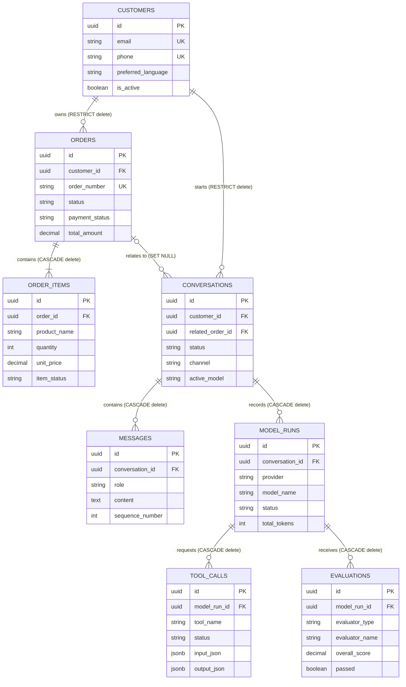

# Database Architecture

[Project overview](PROJECT_OVERVIEW.md) · [Backend](BACKEND_ARCHITECTURE.md) · [AI pipeline](AI_PIPELINE.md)

## Diagram 7 — Entity relationship model

### Plain-English explanation

Customers place orders and start support conversations. Orders contain items. Conversations contain messages and model runs. Each model run can record tool calls and evaluations.

### Engineering explanation

UUID primary keys avoid sequence coupling. Foreign keys enforce ownership. Commerce parents use restrictive deletion where history should be protected. Dependent operational telemetry uses cascading deletion. A conversation’s optional related order uses `SET NULL`, preserving the conversation if an order relationship is removed.

### Why this architecture

The schema separates business truth (customers and orders), interaction history (conversations and messages), and AI observability (runs, calls, evaluations).

### Benefits

- Referential integrity
- Auditable model execution chain
- Independent model comparisons
- Clear cascade semantics
- Extensible JSONB tool payloads

### Tradeoffs

- Joins are required for full end-to-end reports
- Flexible JSONB payloads have weaker column-level typing
- Deletion rules require careful operational understanding

## Migration management

Alembic is the only schema-change mechanism. The current chain is linear and culminates in the Evaluation migration. Both Render development PostgreSQL and the Docker test database use the same revisions; application code never calls `create_all`.

