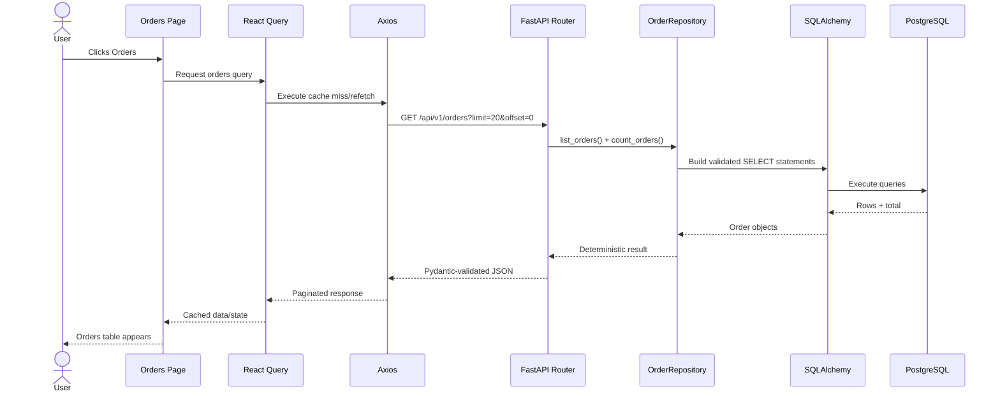
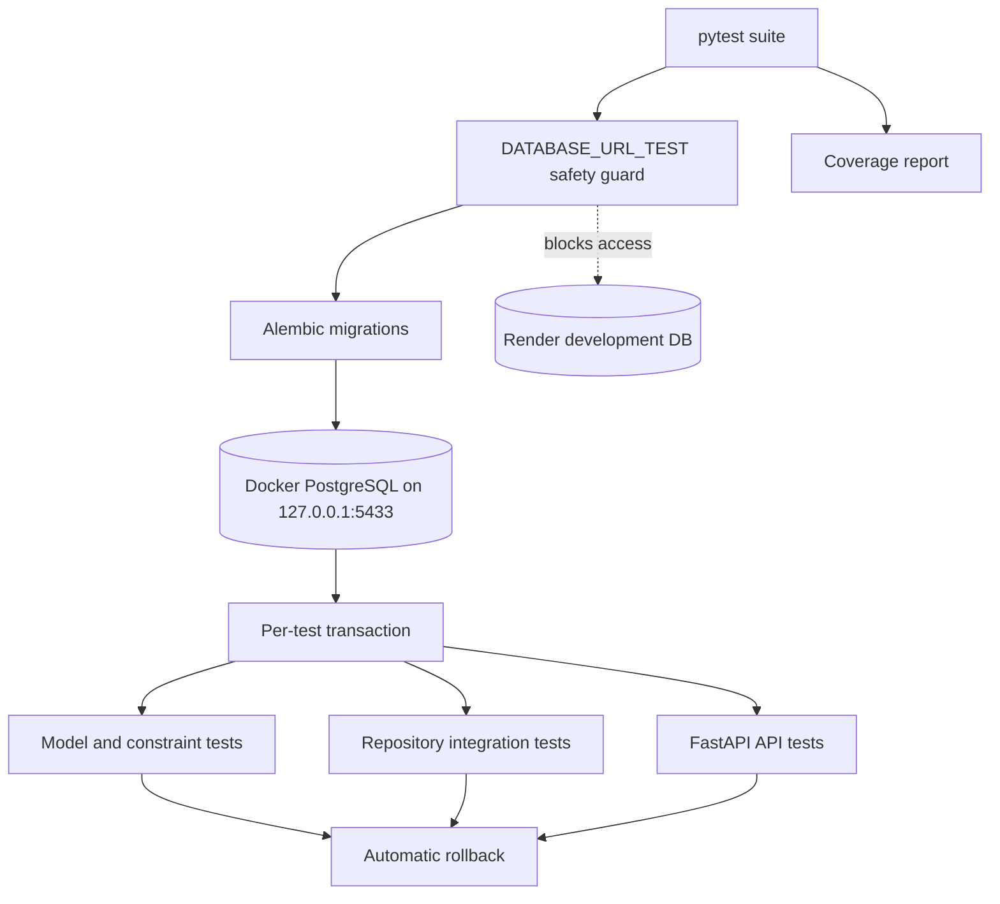

# Data Flow

[System architecture](SYSTEM_ARCHITECTURE.md) · [Frontend](FRONTEND_ARCHITECTURE.md) · [Backend](BACKEND_ARCHITECTURE.md)

## Diagram 8 — API request flow

### Plain-English explanation

Clicking Orders triggers one cached request. The backend reads the database and returns a validated paginated response. The browser then renders the table.

### Engineering explanation

React Query de-duplicates and caches requests by endpoint, page, page size, and server filters. Axios applies the shared base URL. FastAPI validates query parameters, repositories validate domain filters, and Pydantic serializes the response.

### Why this architecture

The flow gives every layer one responsibility and makes loading, retry, error, pagination, and refresh behavior reusable.

### Benefits

- No duplicate page-specific fetch logic
- Cache-aware refresh
- Deterministic pagination
- Consistent validation and errors
- Observable request path

### Tradeoffs

- More hops than direct database access
- Cache keys and backend parameters must remain aligned

## Diagram 9 — Testing architecture

### Plain-English explanation

Tests use a disposable local PostgreSQL database, not the shared Render database. Each test rolls its work back.

### Engineering explanation

`DATABASE_URL_TEST` is mandatory and never falls back to `DATABASE_URL`. Alembic prepares the test schema. Fixtures provide transactional sessions; model, repository, schema, and API integration tests run against PostgreSQL behavior and roll back afterward.

### Why this architecture

SQLite would not faithfully test PostgreSQL UUID, JSONB, constraint, and cascade behavior. Isolation protects shared development data.

### Benefits

- Production-representative database behavior
- Safe destructive constraint tests
- Independent tests
- Reliable coverage metrics
- Render remains untouched

### Tradeoffs

- Docker must be running
- Integration tests are slower than pure unit tests
- Test migrations must stay synchronized with local heads

