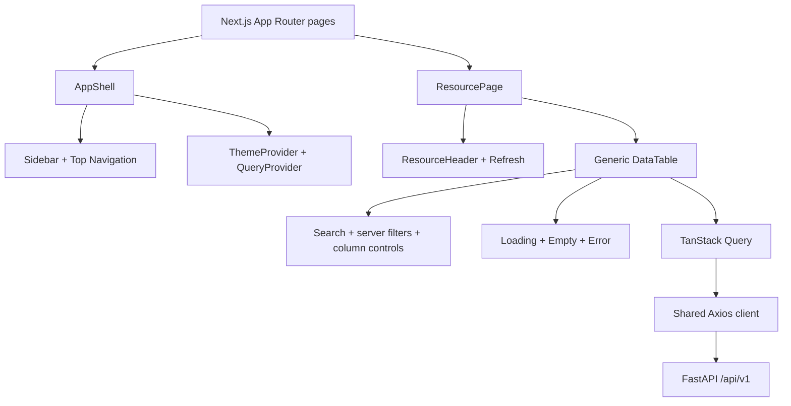

# Frontend Architecture

[Project overview](PROJECT_OVERVIEW.md) · [System architecture](SYSTEM_ARCHITECTURE.md) · [Data flow](DATA_FLOW.md)

## Diagram 4 — Frontend composition

### Plain-English explanation

Every resource page uses the same page header, refresh behavior, table, search, filters, pagination, and status screens. Pages mainly provide a title, API endpoint, columns, and optional filters.

### Engineering explanation

Next.js App Router maps folders to URLs. `AppProviders` installs theme and query contexts; `AppShell` supplies persistent navigation. `ResourcePage<T>` composes the resource header and `DataTable<T>`. TanStack Table handles client sorting/filtering and selection, while TanStack Query handles server pagination and caching.

### Why this architecture

Customers, Orders, Order Items, Conversations, and Messages share behavior but differ in data shape. Generic composition removes duplicated request and state logic.

### Benefits

- Consistent UX and accessibility
- One refresh/cache-key strategy
- New read-only pages require little code
- Centralized loading, empty, and error behavior
- Dark, light, and system themes

### Tradeoffs

- Generic components have more configuration
- Global search and column sorting operate on the currently loaded page
- Very wide datasets require horizontal scrolling

## Key responsibilities

| Area | Responsibility |
|---|---|
| Pages | Declare endpoint, columns, labels, and filters |
| ResourcePage | Page-level header, timestamp, refresh, and table composition |
| DataTable | Query lifecycle, pagination, table state, search, sorting, selection |
| Shared components | Reusable visual states and controls |
| Providers | React Query cache and theme context |
| Layout | Persistent shell, sidebar, and top navigation |
| Axios client | Central API base URL, headers, and timeout |

