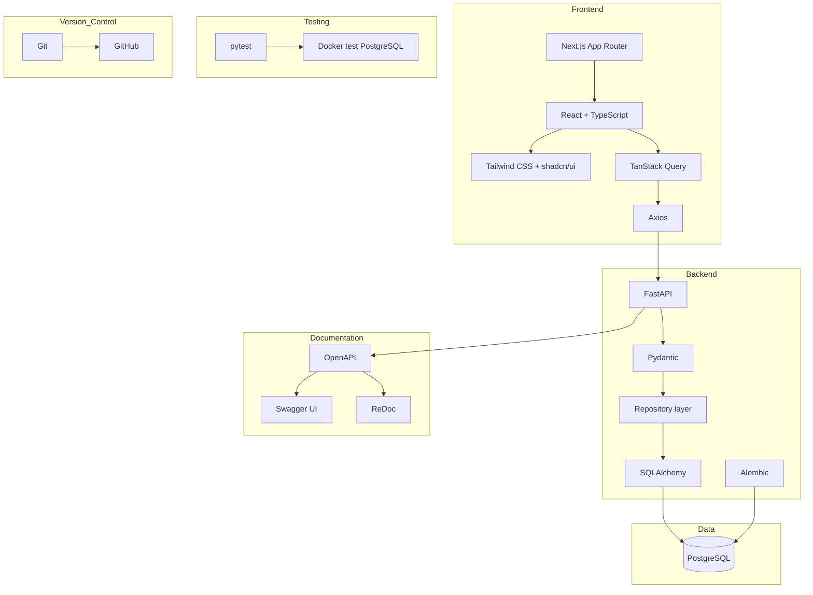

# CX Harness — Project Overview

CX Harness is a read-only customer-experience analytics system. It combines commerce data, support conversations, model execution telemetry, tool-call auditing, and evaluations in one dashboard.

## Documentation map

- [System architecture](SYSTEM_ARCHITECTURE.md)
- [Frontend architecture](FRONTEND_ARCHITECTURE.md)
- [Backend architecture](BACKEND_ARCHITECTURE.md)
- [Database architecture](DATABASE_ARCHITECTURE.md)
- [Data and request flows](DATA_FLOW.md)
- [AI pipeline](AI_PIPELINE.md)

## Diagram 1 — Technology stack

### Plain-English explanation

The browser displays a Next.js dashboard. Axios sends requests to FastAPI, React Query caches the results, and PostgreSQL stores the data. Docker provides a separate test database, while Swagger and ReDoc explain the API.

### Engineering explanation

The stack separates presentation, transport, validation, querying, persistence, migration, and testing concerns. TypeScript protects frontend contracts; Pydantic protects API contracts; SQLAlchemy maps Python objects to relational data; Alembic versions schema changes.

### Why this architecture

Each technology has one clear responsibility and is widely understood, reducing prototype risk while leaving room for future model-provider and dashboard expansion.

### Benefits

- Strong typing at both API boundaries
- Reusable read-only data pages
- Managed development database plus isolated local test database
- Automatic API documentation
- Reproducible schema history

### Tradeoffs

- Two language ecosystems require separate tooling
- A remote development database depends on network availability
- Client-side tables currently sort and search only loaded pages

## Current product boundary

Implemented today: database schema, migrations, repositories, response schemas, read-only API, overview dashboard, and resource pages for customers, orders, order items, conversations, and messages.

Planned later: live provider adapters, harness orchestration, business-tool execution, automatic evaluation generation, deployment automation, and the remaining telemetry pages.

