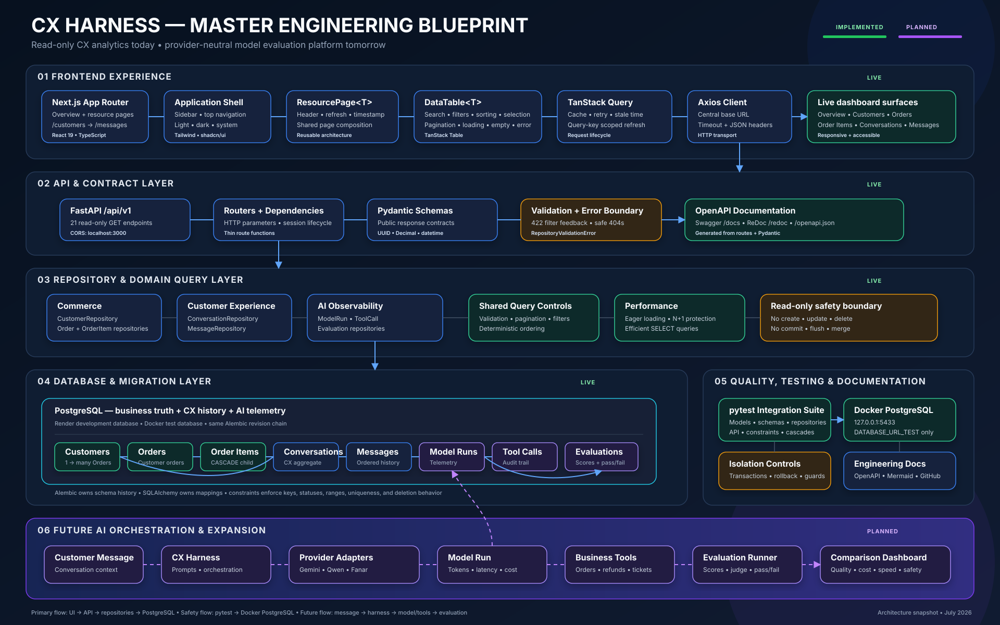
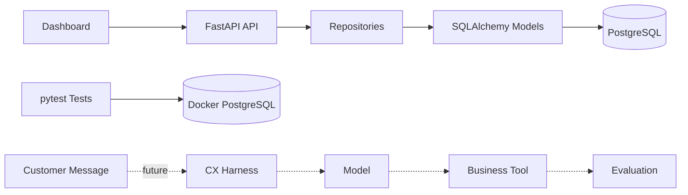
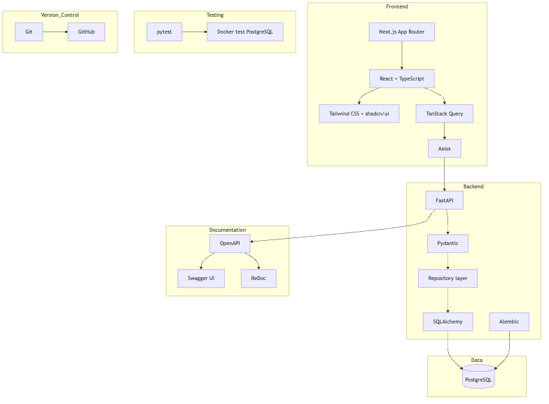
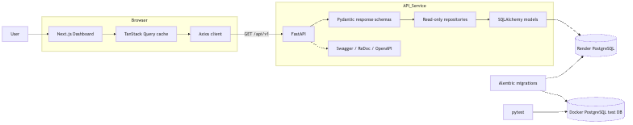
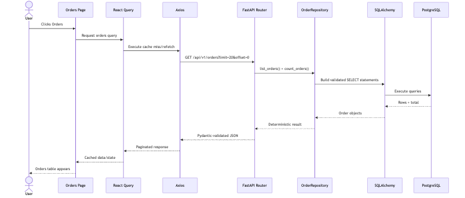
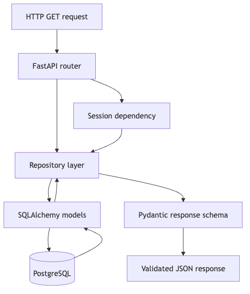
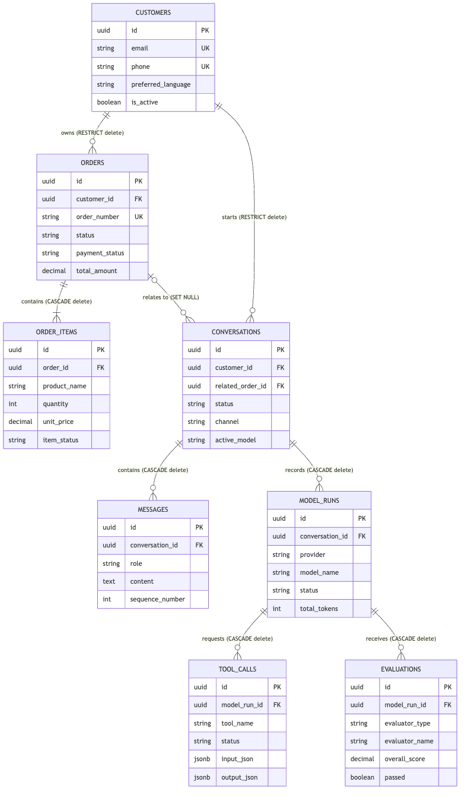
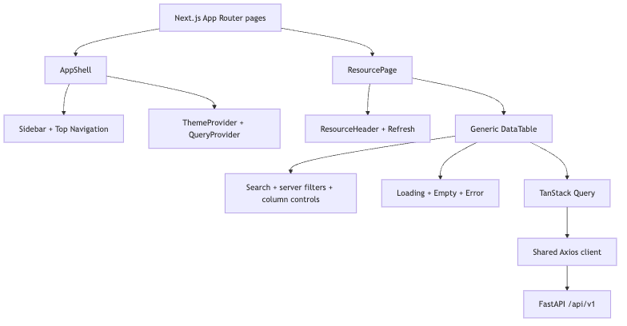
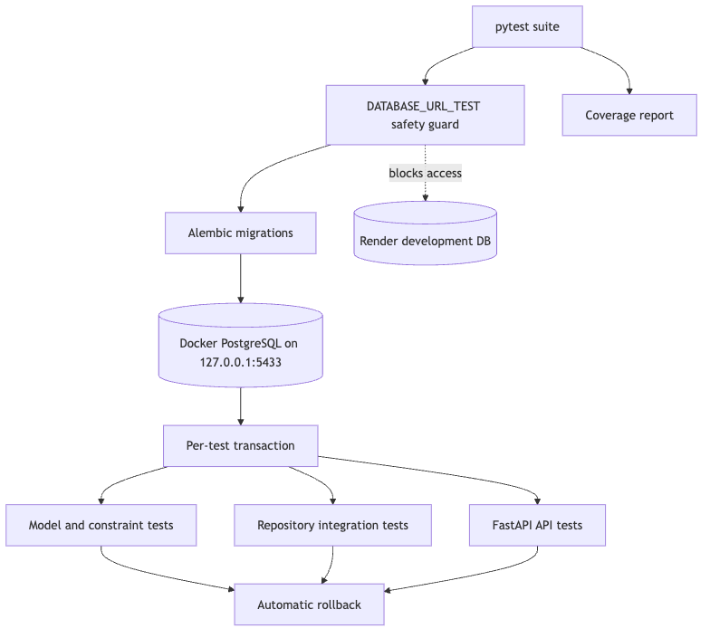
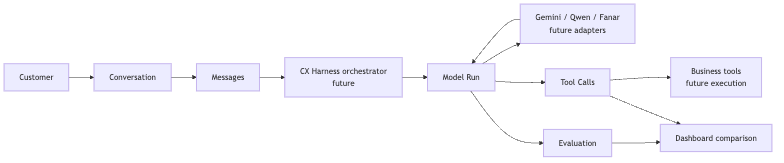

# CX Harness Architecture

A visual guide to how the CX Harness dashboard, API, database, tests, and future AI orchestration fit together.

## Master engineering blueprint

This single large canvas is the primary architecture artifact for design reviews and stakeholder presentations. It shows the implemented frontend-to-database path, test and documentation boundaries, current AI observability data, and explicitly marked future orchestration expansion.

- [Open editable SVG](CX_HARNESS_MASTER_BLUEPRINT.svg)
- [Open high-resolution PNG](CX_HARNESS_MASTER_BLUEPRINT.png)
- [Read the blueprint legend and executive summary](CX_HARNESS_MASTER_BLUEPRINT.md)
- Continue below for the supporting diagrams and detailed explanations.

## Table of contents

1. [Project purpose](#1-project-purpose)
2. [High-level system architecture](#2-high-level-system-architecture)
3. [End-to-end request flow](#3-end-to-end-request-flow)
4. [Backend architecture](#4-backend-architecture)
5. [Database ER diagram](#5-database-er-diagram)
6. [Frontend architecture](#6-frontend-architecture)
7. [Testing architecture](#7-testing-architecture)
8. [Current AI data pipeline](#8-current-ai-data-pipeline)
9. [Future CX Harness pipeline](#9-future-cx-harness-pipeline)
10. [Technology stack summary](#10-technology-stack-summary)
11. [Detailed documentation](#detailed-documentation)

## Executive Summary

CX Harness is a read-only platform for understanding customer commerce activity, support conversations, and AI-model performance in one dashboard.

Already built:

- A Next.js dashboard with live overview and resource tables
- A FastAPI API with versioned, read-only endpoints
- PostgreSQL tables for commerce, conversations, model runs, tool calls, and evaluations
- Repository, Pydantic, SQLAlchemy, and Alembic layers
- Isolated PostgreSQL integration testing through Docker

Data moves from PostgreSQL through SQLAlchemy repositories and FastAPI, then through Axios and React Query into reusable dashboard tables. The architecture is reliable because API contracts are validated, database relationships are constrained, migrations are versioned, and tests never use the shared Render development database.

The project can already display stored model-run, tool-call, and evaluation records. Live LLM provider calls, tool execution, harness orchestration, and automatic evaluation generation are future work.

## Learning map

Think of the system as three connected paths:

- **Application path:** dashboard → API → repositories → models → PostgreSQL
- **Safety path:** tests → isolated Docker PostgreSQL
- **Future AI path:** customer message → harness → model → tool → evaluation

## 1. Project purpose

**Simple explanation:** The platform combines a web dashboard, a Python API, PostgreSQL storage, automated tests, and API documentation.

**Technical explanation:** Next.js and React render the UI. React Query and Axios call FastAPI. Pydantic validates API responses, repositories build read-only SQLAlchemy queries, and Alembic versions PostgreSQL schema changes.

**Why it exists:** Teams need one place to inspect commerce data, customer-support interactions, and AI execution telemetry.

**Connections:** Browser technologies connect to FastAPI; FastAPI connects to the repository and persistence layers; pytest connects only to Docker PostgreSQL.

**Implemented now:** Full backend foundation, live overview, and resource pages through Messages.

**Planned later:** Remaining telemetry pages, provider integrations, AI execution, and deployment automation.

## 2. High-level system architecture

**Simple explanation:** A user opens the dashboard, which requests data from the API. The API reads PostgreSQL and returns safe JSON.

**Technical explanation:** TanStack Query caches requests; Axios supplies centralized HTTP configuration; FastAPI routes use Pydantic schemas, repositories, and SQLAlchemy sessions. Alembic manages schema revisions.

**Why it exists:** Layer boundaries make the system easier to test, explain, and change safely.

**Connections:** User → Next.js → React Query → Axios → FastAPI → Pydantic/repositories → SQLAlchemy → PostgreSQL.

**Implemented now:** This complete read-only request path is live.

**Planned later:** Deployment infrastructure and write-oriented business workflows.

## 3. End-to-end request flow

**Simple explanation:** Clicking Orders loads the correct page, retrieves a page of orders, and displays it in the shared table.

**Technical explanation:** The React Query key includes endpoint, pagination, and server filters. FastAPI validates query parameters, repositories apply deterministic queries, and Pydantic serializes the response.

**Why it exists:** One predictable request flow prevents duplicated fetching and inconsistent error handling.

**Connections:** React interaction travels through every layer and returns along the same path as a paginated response.

**Implemented now:** Search, backend pagination, filtering, refresh, loading, empty, and error states.

**Planned later:** Mutations, optimistic updates, and authenticated workflows.

## 4. Backend architecture

**Simple explanation:** FastAPI handles web requests, repositories handle database questions, and Pydantic controls what clients receive.

**Technical explanation:** Routes own HTTP concerns; session dependencies own connection lifecycle; repositories own validation, filtering, ordering, pagination, and eager loading; ORM models own persistence mappings.

**Why it exists:** Database models should not automatically become public API contracts.

**Connections:** Router → session/repository → SQLAlchemy → PostgreSQL → Pydantic response.

**Implemented now:** Eight read-only repositories and 21 versioned API endpoints.

**Planned later:** Service and orchestration layers for business actions and AI execution.

See the [repository overview](diagrams/09-repository-overview.png) and [detailed backend guide](detailed/BACKEND_ARCHITECTURE.md).

## 5. Database ER diagram

**Simple explanation:** Customers own orders and conversations. Conversations contain messages and model runs. Runs contain tool calls and evaluations.

**Technical explanation:** UUID keys, foreign keys, checks, unique constraints, and explicit deletion rules preserve referential integrity and audit history.

**Why it exists:** Business truth, conversation history, and AI observability need distinct but connected records.

**Connections:** Customer → Orders/Conversations; Order → Order Items; Conversation → Messages/Model Runs; Model Run → Tool Calls/Evaluations.

**Implemented now:** All eight tables and their Alembic migrations exist on development and test PostgreSQL.

**Planned later:** Additional reporting structures only if cross-domain analytics require them.

## 6. Frontend architecture

**Simple explanation:** Every resource page uses the same header, filters, table, pagination, refresh, and state components.

**Technical explanation:** App Router pages provide endpoint, columns, and filters to `ResourcePage<T>`, which composes `DataTable<T>`. Providers install React Query and theme contexts inside the persistent application shell.

**Why it exists:** Shared behavior keeps pages consistent and makes new read-only pages inexpensive.

**Connections:** Page → ResourcePage → DataTable → React Query → Axios → FastAPI.

**Implemented now:** Overview, Customers, Orders, Order Items, Conversations, and Messages.

**Planned later:** Model Runs, Tool Calls, Evaluations, and richer drill-down views.

## 7. Testing architecture

**Simple explanation:** Tests run against a local Docker database and roll back their changes.

**Technical explanation:** `DATABASE_URL_TEST` is mandatory and never falls back to `DATABASE_URL`. Alembic prepares PostgreSQL, transactional fixtures isolate tests, and pytest covers models, schemas, repositories, and APIs.

**Why it exists:** PostgreSQL-specific behavior must be tested without risking shared Render data.

**Connections:** pytest → safety guard → Alembic → Docker PostgreSQL → transactional model/repository/API tests.

**Implemented now:** An integration-focused backend suite with coverage reporting.

**Planned later:** CI execution and deployment gates.

The broader workflow is shown in [development workflow](diagrams/08-development-workflow.png).

## 8. Current AI data pipeline

**Simple explanation:** The database already stores conversations, messages, model runs, tool calls, and evaluations as an auditable chain.

**Technical explanation:** A conversation may have many ordered messages and model runs. Each model run may have many tool calls and evaluations. These relationships support comparison without changing the original customer history.

**Why it exists:** The project needs durable evidence for latency, tokens, cost, tools, outcomes, and quality scores.

**Connections:** Conversation → Messages → Model Runs → Tool Calls/Evaluations.

**Implemented now:** Models, migrations, repositories, schemas, APIs, and synthetic records for the current data layer.

**Planned later:** Creating these records from actual provider responses and tool executions.

## 9. Future CX Harness pipeline

**Simple explanation:** A future harness will send conversation context to a model, coordinate business tools, and evaluate the result.

**Technical explanation:** Provider-neutral adapters and tool interfaces should isolate orchestration from Gemini, Qwen, Fanar, or deployment-specific APIs. Evaluation should run after a real model response exists.

**Why it exists:** Fair model comparison requires repeatable prompts, tools, telemetry, and evaluation.

**Connections:** Customer → Conversation → Messages → Harness → Model Run → Provider/Tool Calls → Evaluation → Dashboard.

**Implemented now:** The persistence and read-only observability foundation.

**Planned later:** Provider adapters, prompt orchestration, business-tool execution, evaluation runners, and production inference endpoints.

## 10. Technology stack summary

| Layer | Technologies | Purpose |
|---|---|---|
| Frontend | Next.js, React, TypeScript | Routing, rendering, and type-safe UI |
| UI | Tailwind CSS, shadcn/ui, Lucide | Consistent responsive components |
| Data fetching | TanStack Query, Axios | Cache lifecycle and HTTP configuration |
| Backend | FastAPI, Pydantic | Versioned API and validated contracts |
| Persistence | SQLAlchemy, Alembic | ORM queries and schema migrations |
| Database | PostgreSQL | Relational integrity and PostgreSQL-native types |
| Testing | pytest, Docker | Isolated integration testing |
| Documentation | OpenAPI, Swagger, ReDoc, Mermaid | API and architecture communication |
| Version control | Git, GitHub | Traceable collaboration and release history |

**Implemented now:** Every technology above is present in the repository.

**Planned later:** CI/CD, hosted frontend/backend deployment, and remote AI inference infrastructure.

## Detailed documentation

For deeper engineering context:

1. [Project Overview](detailed/PROJECT_OVERVIEW.md)
2. [System Architecture](detailed/SYSTEM_ARCHITECTURE.md)
3. [Data Flow](detailed/DATA_FLOW.md)
4. [Backend Architecture](detailed/BACKEND_ARCHITECTURE.md)
5. [Database Architecture](detailed/DATABASE_ARCHITECTURE.md)
6. [Frontend Architecture](detailed/FRONTEND_ARCHITECTURE.md)
7. [AI Pipeline](detailed/AI_PIPELINE.md)
