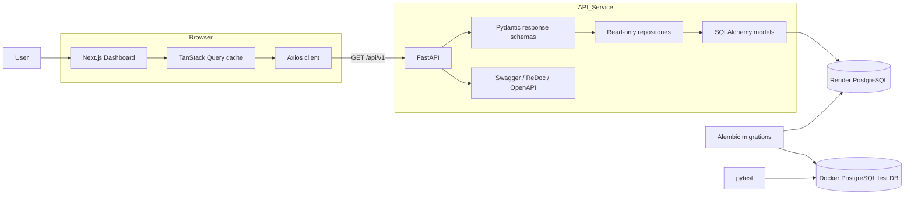
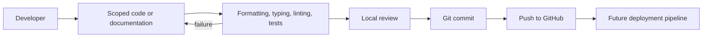

# System Architecture

[Project overview](PROJECT_OVERVIEW.md) · [Frontend](FRONTEND_ARCHITECTURE.md) · [Backend](BACKEND_ARCHITECTURE.md) · [Database](DATABASE_ARCHITECTURE.md)

## Diagram 2 — High-level system

### Plain-English explanation

The user interacts with a dashboard. The dashboard requests data from FastAPI, which validates the response shape and asks repositories to read PostgreSQL. Alembic manages the database structure. Automated tests use a separate Docker database.

### Engineering explanation

The browser and API communicate over versioned HTTP endpoints. React Query owns request lifecycle and caching; Axios owns HTTP configuration. FastAPI routes depend on database sessions, Pydantic serializes ORM results, and repositories encapsulate query behavior. Production-like development data lives on Render; destructive integration tests are isolated locally.

### Why this architecture

The system uses conventional layers so each part can evolve independently. A dashboard redesign does not require database changes, and a query optimization does not alter API consumers.

### Benefits

- Clear ownership and fault boundaries
- Read-only dashboard safety
- Test isolation from Render
- API discoverability through OpenAPI
- Replaceable frontend or persistence layers

### Tradeoffs

- More files and abstractions than a single-service prototype
- Cross-layer schema changes require coordinated updates
- Render connectivity adds external latency during local development

## Diagram 3 — Development workflow

### Plain-English explanation

Work is changed locally, checked, reviewed, committed, and pushed. Deployment is intentionally shown as future work.

### Engineering explanation

Frontend commits are guarded by Husky and lint-staged. Backend confidence comes from pytest integration suites. Git provides local history; GitHub is the shared source of truth.

### Why this architecture

Short feedback loops catch defects before shared branches receive them, while small milestone commits preserve traceability.

### Benefits

- Reproducible checks
- Reviewable incremental history
- Lower regression risk
- Clear path to future CI/CD

### Tradeoffs

- Local checks consume time
- Until CI is added, enforcement still depends partly on developer workflow

