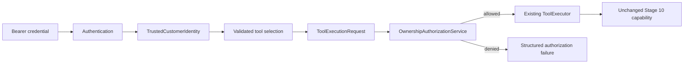

# Stage 11.2 — Authorization and Permissions

## Purpose

Authorization answers **what an authenticated customer may access**. It runs
after Stage 11.1 establishes identity and immediately before the execution
gateway can invoke a business tool.

Authentication and authorization are deliberately separate. Authentication
validates the signed identity assertion and produces `TrustedCustomerIdentity`.
Authorization consumes the resulting `ExecutionContext.customer_id`, immutable
tool metadata, and validated resource arguments. It does not validate passwords,
tokens, signatures, providers, prompts, or model output.

## Protected resources

| Domain | Authorization rule |
|---|---|
| Customer | Identity-scoped tools may read only the authenticated customer's projection |
| Orders | Collection reads are scoped to the authenticated customer; order-number reads require ownership |
| Delivery | Ownership of the related order is required |
| Payment | Ownership of the related order is required |
| Refund | Ownership of the related order is required |
| Knowledge | Approved customer-facing policy content is public and needs no ownership lookup |

Rules are derived from existing `ToolMetadata` declarations such as
`requires_customer_identity`, `requires_order_ownership`, category, and
grounding capabilities. The policy contains no business tool-name list and is
provider-independent.

## Ownership resolution

`SQLAlchemyBusinessResourceOwnershipResolver` uses the existing read-only
`OrderRepository`. An owned order is allowed. An existing order owned by another
customer is denied before the tool is instantiated or audited. A missing order
continues to the unchanged tool so its existing safe not-found result remains
stable and authorization does not disclose whether another customer's resource
exists.

Customer collection tools receive no target customer ID; their database reads
remain scoped exclusively by the trusted context. A mismatched customer ID in
an authorization request is denied. Stage 10 repository ownership checks remain
as defense in depth rather than being removed or duplicated.

## Failure behavior

| Code | HTTP status | Behavior |
|---|---:|---|
| `access_denied` | 403 | Trusted identity does not satisfy the declared scope |
| `resource_ownership_mismatch` | 403 | Requested customer scope conflicts with trusted identity |
| `unauthorized_resource` | 403 | Customer does not own the requested transactional resource |
| `authorization_unavailable` | 503 | Ownership could not be safely verified |

Authorization failures become standard failed `ToolResult` values at the
execution gateway, so the tool is never called and no tool-execution audit is
started. The application boundary maps these stable codes to safe HTTP errors;
internal ownership state, SQL errors, and repository details are not exposed.

## Scope and limitations

- No roles, administrative permissions, delegation, or policy engine are added.
- No write permission exists.
- Stage 9 provider and bounded-loop contracts are unchanged.
- Stage 10 tools, repositories, schemas, and business failures are unchanged.
- Authorization currently covers the resource identifiers used by existing
  Stage 10 capabilities. Future domains should extend declarative resource
  metadata and resolvers rather than adding tool-name checks.
