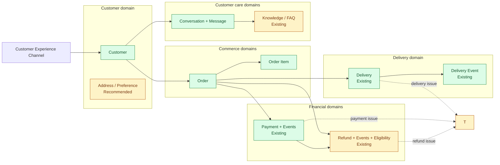

# CX Harness Business Domain Architecture

## Purpose and scope

This document defines the business capability boundaries for a modern grocery
delivery customer-experience platform. It is the design foundation for future
read-only Stage 10 capabilities. It does not define orchestration behavior,
provider behavior, APIs, repositories, database migrations, or executable
business tools.

The architecture distinguishes three states:

- **Existing:** represented by the current application schema.
- **Recommended:** a missing business concept that should be designed before it
  is persisted; no table is created by this document.
- **Stage 12 write:** a future mutation that is explicitly outside Stage 10.

## Business capability map

Solid arrows represent ownership or a strong business reference. Dotted arrows
represent optional case context or information lookup. A domain may consume
another domain's published read model, but it must not reach into another
domain's persistence internals.

## Capability boundary principles

1. **Each domain owns its terminology and state.** Order status is owned by
   Orders; delivery status is owned by Delivery; payment status is owned by
   Payments. Similar-looking fields must not become competing sources of truth.
2. **Customer identity is trusted context.** Customer identity comes from the
   authenticated backend boundary, never from model-generated arguments.
3. **Customer-facing identifiers are accepted.** Customers use order numbers,
   ticket references, shipment references, and refund references—not internal
   UUIDs.
4. **Stage 10 is read-only.** Capabilities retrieve or explain state without
   changing business records.
5. **Stage 12 owns mutations.** Cancellation, refund requests, address changes,
   substitutions, payment actions, and ticket updates require authorization,
   policy, idempotency, audit, and transactional design.
6. **Cross-domain access uses contracts.** A capability may compose domain read
   results, but database models and repository details do not cross the public
   business boundary.
7. **Customer-safe projection is mandatory.** Internal fraud flags, payment
   credentials, driver personal data, operational notes, and raw exceptions are
   never exposed through customer-facing capabilities.

## Domain catalog

### 1. Customer

**Purpose:** Represent the authenticated shopper and the preferences needed to
provide relevant, localized customer care.

**Main entities**

- `Customer` — **existing**; name, contact information, and preferred language.
- `CustomerAddress` — **recommended** if multiple saved addresses are required.
- `CustomerPreference` — **recommended** for substitution and communication
  preferences that are not authentication credentials.

**Read-only Stage 10 capabilities**

- Retrieve a customer-safe profile for the trusted customer.
- Retrieve preferred language and communication preferences.
- List the trusted customer's recent orders and support cases.
- Retrieve saved-address labels and redacted delivery locations when authorized.

**Future Stage 12 write capabilities**

- Update contact details or preferred language.
- Add, edit, or remove a saved address.
- Change substitution or communication preferences.
- Request account closure or data export.

**Dependencies:** Authentication/identity establishes the customer ID. Orders,
Payments, Refunds, and Support reference the customer but do not own customer
profile data.

### 2. Orders

**Purpose:** Represent the commercial purchase and its lifecycle from placement
through fulfilment, cancellation, or completion.

**Main entities**

- `Order` — **existing**; customer-facing order number, lifecycle status,
  order-level payment snapshot, amount, delivery address snapshot, and dates.
- `OrderStatusHistory` — **recommended** if an auditable lifecycle timeline is
  required.

**Read-only Stage 10 capabilities**

- Resolve an order using its customer-facing order number.
- Verify ownership using trusted customer identity.
- Retrieve current order status, total, creation time, and estimated delivery.
- List recent orders for the trusted customer.
- Explain a status using shared customer-facing terminology.

The existing `get_order_status` capability is the first implemented read-only
example. New capabilities should follow the same ownership and safe-projection
rules rather than duplicating repository queries.

**Future Stage 12 write capabilities**

- Cancel an eligible order.
- Change an eligible delivery address or slot.
- Confirm or reject substitutions.
- Add delivery instructions before the operational cutoff.

**Dependencies:** Customer owns the order relationship. Order Items describes
the basket. Delivery owns physical fulfilment. Payments owns monetary state.
Refunds references the original order and payment.

### 3. Order Items

**Purpose:** Represent the products, quantities, prices, substitutions, and
fulfilment state within an order.

**Main entities**

- `OrderItem` — **existing**; product name, quantity, unit price, and item status.
- `ProductReference` — **recommended external reference** to a catalog/SKU; the
  CX platform should not become the product catalog's source of truth.
- `Substitution` — **recommended** when original/replacement lineage matters.

**Read-only Stage 10 capabilities**

- List customer-safe items for an owned order.
- Explain included, missing, substituted, refunded, or cancelled item states.
- Calculate the displayed item subtotal from stored quantity and unit price.
- Identify affected items for a support or refund inquiry.

**Future Stage 12 write capabilities**

- Accept or reject a proposed substitution.
- Report a missing, damaged, or incorrect item.
- Change an item quantity before the fulfilment cutoff.

**Dependencies:** Belongs to Orders. Product descriptions may come from a
catalog. Refund line items may reference one or more Order Items.

### 4. Delivery

**Purpose:** Own physical fulfilment, tracking, ETA, delivery events, and final
delivery outcome independently from the commercial order lifecycle.

**Main entities**

- Delivery address and estimated delivery time — **currently embedded on Order**.
- `Delivery` — **existing** normalized one-to-one aggregate linked to an order;
  owns current state, ETA, and optional delivery window.
- `DeliveryEvent` — **existing** ordered customer-visible tracking event,
  including delivery attempts.
- `DriverAssignment` — **recommended operational reference**; expose no driver
  personal data through customer capabilities.

**Read-only Stage 10 capabilities**

- Retrieve delivery status and current ETA for an owned order.
- Retrieve a customer-safe tracking timeline.
- Explain a delay or failed delivery using approved reason codes.
- Retrieve delivery window and redacted destination information.

**Future Stage 12 write capabilities**

- Reschedule an eligible delivery.
- Update delivery instructions or location within policy.
- Confirm receipt or report non-delivery.
- Escalate a delayed or failed delivery.

**Dependencies:** Orders supplies the commercial reference and customer
ownership. Support handles exceptions. External courier or fulfilment systems
may remain the operational source of truth.

**Implemented boundary:** `Delivery` and `DeliveryEvent` are normalized tables.
The pre-existing order ETA remains a commerce snapshot; delivery capabilities
use the Delivery aggregate as their source of truth. Multi-shipment orders are
still outside the current one-delivery-per-order model.

### 5. Payments

**Purpose:** Own authorization, capture, settlement, failure, and customer-safe
payment status without exposing payment credentials.

**Main entities**

- `Order.payment_status` — **existing snapshot only**.
- `Payment` — **existing** normalized payment attempt linked to an order; stores
  customer-safe state, method type, amount, currency, and public failure reason.
- `PaymentEvent` — **existing** ordered customer-visible lifecycle event.
- Processor payment references and credentials are intentionally not persisted
  in the CX read model.

**Read-only Stage 10 capabilities**

- Retrieve current customer-safe payment status for an owned order.
- Explain pending, paid, failed, refunded, or partially refunded states.
- Retrieve redacted payment-method type and transaction timestamps.
- Distinguish an order problem from a payment problem.

**Future Stage 12 write capabilities**

- Retry or replace a failed payment through a PCI-compliant provider flow.
- Authorize or capture payment where operational policy allows.
- Void an authorization during eligible cancellation.

**Dependencies:** Orders defines the amount and commercial purpose. Refunds
references settled payment transactions. An external payment service is the
financial source of truth.

**Implemented boundary:** `Payment` supports multiple attempts per order and
`PaymentEvent` supplies customer-visible history across attempts. The existing
order payment status remains a commerce snapshot rather than event evidence.
Processor reconciliation and real payment processing remain outside CX Harness.

### 6. Refunds

**Purpose:** Represent customer compensation against an order, payment, or
specific items, including lifecycle and failure reasons.

**Main entities**

- `Refund` — **existing** normalized refund linked to its originating payment.
- `RefundEvent` — **existing** customer-visible status timeline.
- `RefundEligibility` — **existing** trusted order-level business assessment;
  it reports eligibility but never approves or executes a refund.
- `RefundItem` — **recommended** future allocation to affected order items.
- `RefundReason` — controlled terminology shared with Support.

**Read-only Stage 10 capabilities**

- Retrieve refund eligibility information from approved policy sources.
- Retrieve refund status and expected settlement timing.
- List refunds for an owned order.
- Explain rejected or delayed refunds using customer-safe reasons.

**Future Stage 12 write capabilities**

- Request a full or partial refund.
- Approve, reject, or cancel a refund according to role and policy.
- Retry a failed provider refund.

**Dependencies:** Orders and Order Items define the purchased scope. Payments
provides the settled transaction. Conversations may provide customer context
but must not own refund state.

**Implemented boundary:** Refund reads support full, partial, pending, rejected,
and multiple-refund histories. Eligibility is read from a persisted business
assessment instead of being inferred by the harness. Processor identifiers and
internal audit data are deliberately absent from customer projections.

**Future schema recommendation:** Add `RefundItem` only when item-level refund
allocation becomes an approved requirement.

### 7. Knowledge / FAQ

**Purpose:** Provide approved, versioned explanations of policies, processes,
and common questions without treating model knowledge as a business source of
truth.

**Main entities**

- `KnowledgeArticle` — **existing** stable topic identity, category, locale, and
  active publication boundary.
- `KnowledgeArticleVersion` — **existing** immutable revision history with
  explicit publication state and effective timestamp.
- `KnowledgeCategory` — **recommended** controlled taxonomy.
- `PolicyRuleReference` — **recommended** link to machine-enforced policy; an
  article must not replace executable eligibility rules.

**Read-only Stage 10 capabilities**

- Search approved articles by intent, locale, and effective date.
- Retrieve one current article by stable key.
- Answer process questions with an article reference.
- Retrieve localized FAQ content and escalation guidance.

**Implemented boundary:** Repository queries expose only active articles and
published versions. Responses carry title, version, category, language, and
last-updated metadata. Related articles currently use their controlled category;
an explicit relation table is intentionally deferred until curated links are
required.

Knowledge supplies policy evidence only. It never satisfies customer-specific
state by itself; transactional facts remain owned by Customer, Order, Delivery,
Payment, and Refund capabilities. A deterministic local seed provides approved
demo articles and filtering examples without creating a production authoring
system.

Cross-domain journeys combine these boundaries without transferring ownership:
transactional domains prove current customer state, while Knowledge supplies
general policy. The existing bounded runtime preserves tool order, stops on a
structured business failure, and accepts a final response only after all
required evidence capabilities are satisfied. See
`cross-domain-customer-journeys.md` for the verified journey matrix.

**Future Stage 12 write capabilities**

- Author, review, approve, publish, expire, or localize knowledge content.
- Manage categories and article-to-policy references.

**Dependencies:** All domains may consume approved explanations. A CMS may
remain the source of truth.

## Relationship model

| Source | Relationship | Target | Cardinality / rule |
|---|---|---|---|
| Customer | places | Order | One-to-many; existing |
| Order | contains | Order Item | One-to-many; existing |
| Order | fulfilled by | Delivery | One-to-one initially; allow one-to-many later |
| Delivery | records | Delivery Event | One-to-many, chronological |
| Order | paid through | Payment Transaction | One-to-many attempts |
| Order | may receive | Refund | One-to-many |
| Refund | allocates to | Refund Item | One-to-many |
| Refund Item | references | Order Item | Many-to-one |
| Conversation | contains | Message | One-to-many ordered; existing |
| Knowledge Article | explains | Domain/process | Many-to-many taxonomy |

Cross-domain references should use stable identifiers and explicit read
contracts. Avoid polymorphic database foreign keys unless their integrity and
query behavior are designed deliberately; typed link tables or explicit
nullable references are safer when future relationships require them.

## Shared business terminology

| Term | Definition |
|---|---|
| Customer | Authenticated shopper receiving service; not the model's claimed identity |
| Order number | Customer-facing stable identifier such as `ORD-10025` |
| Order status | Commercial order lifecycle, distinct from delivery and payment status |
| Item status | Fulfilment outcome for one ordered line |
| Delivery / Shipment | Physical fulfilment instance for an order |
| ETA | Current estimated arrival time, not a delivery guarantee |
| Payment status | State of payment processing, not proof of order fulfilment |
| Refund | Money returned or scheduled to return against settled payment |
| Conversation | Ordered communication history across customer and assistant/agent |
| Business failure | Expected outcome such as not found, ineligible, or access denied |
| Technical failure | Unexpected infrastructure or software failure |
| Customer-safe projection | Minimal authorized data suitable for customer disclosure |
| Source of truth | System/domain authoritative for a particular state |

Status values should be mapped to this shared vocabulary at domain boundaries.
Do not reuse one generic `status` enumeration across unrelated domains.

## Read-only Stage 10 capability portfolio

| Domain | Initial capability candidates | Required authorization boundary |
|---|---|---|
| Customer | Safe profile and preference retrieval | Trusted customer identity |
| Orders | Order status and recent-order lookup | Customer owns order |
| Order Items | Item list and fulfilment explanation | Customer owns parent order |
| Delivery | ETA, status, and event timeline | Customer owns related order |
| Payments | Customer-safe payment status | Customer owns related order |
| Refunds | Refund status and history | Customer owns related order/refund |
| Knowledge | Approved article search and retrieval | Locale/channel; public or scoped article |

Capability implementations should return explicit success or safe business
failure contracts. “Not found” and “not owned” may intentionally share public
wording where revealing existence would create an information-disclosure risk.

## Stage 12 write capability gate

No write capability should be enabled merely by adding a tool. Before Stage 12,
each mutation requires:

- authenticated actor and explicit authorization policy;
- ownership and business eligibility checks;
- idempotency key and duplicate-request behavior;
- transactional boundary and concurrency policy;
- before/after audit evidence with payload redaction;
- confirmation requirements for destructive or financial actions;
- compensating action for downstream partial failure;
- stable public failure codes and human-escalation path;
- integration contract with the authoritative external system;
- focused unit, integration, security, and rollback tests.

## Recommended Stage 10 implementation order

1. **Stage 10.2 — Domain read contracts:** Define immutable, customer-safe
   request/result contracts and common business failures without database work.
2. **Customer and order read boundary:** Reuse current entities and repositories;
   consolidate ownership and customer-facing identifier rules around the existing
   order-status capability.
3. **Order-item read capabilities:** Add item projections through the existing
   repository layer, preserving parent-order ownership checks.
4. **Knowledge read boundary:** Integrate an approved static/CMS-backed source so
   policy explanations are grounded independently of transactional data.
5. **Delivery read model design:** Decide whether the operational source is local
   PostgreSQL or an external fulfilment API before adding a Delivery entity.
6. **Payment and refund read model design:** Establish provider-safe projections
   and reconciliation ownership before implementing customer capabilities.
7. **Cross-domain composition tests:** Verify ownership, safe projections,
   terminology, absence of writes, and deterministic business failures.

## Risks and architectural recommendations

- **Identity risk:** A conversation UUID alone is not authentication. External
  deployment requires an authenticated principal mapped to the conversation's
  customer before customer data is disclosed.
- **Source-of-truth ambiguity:** Current order-level delivery and payment fields
  are snapshots. Do not present them as detailed transaction or tracking history.
- **Domain leakage:** Avoid repositories joining across every domain to produce a
  “complete customer” object. Compose small read contracts at the service layer.
- **PII and payment risk:** Apply field-level allowlists, redaction, least
  privilege, and PCI boundaries. Never expose raw provider payloads.
- **Status drift:** Use domain-owned status vocabularies and explicit mappings
  from external systems.
- **Partial fulfilment:** Design Delivery and Refund cardinality for split
  shipments, substitutions, partial refunds, and repeated payment attempts.
- **Knowledge freshness:** Articles require versioning, approval, locale, and
  effective dates; model training knowledge is not an approved policy source.
- **Write safety:** Keep Stage 10 read-only. Stage 12 mutations must pass the
  authorization, idempotency, audit, and transaction gate above.

## Readiness for Stage 10.2

The domains, ownership boundaries, terminology, missing-entity recommendations,
read-only capability portfolio, and Stage 12 mutation boundary are defined.
Stage 10.2 can begin with immutable domain read contracts without changing the
Stage 9 orchestration platform.
