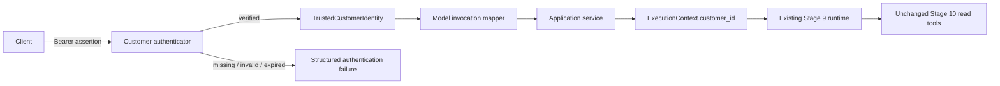

# Stage 11.1 — Identity and Authentication

## Purpose

Authentication answers **who is making the request** before the model mapper,
runtime, or any business capability can run. It does not decide which records
the customer may access or which tools they may use; those authorization
decisions remain outside Stage 11.1.

## Architecture

The HTTP boundary uses the `CustomerBearerAuth` OpenAPI security scheme. The
default verifier accepts a locally signed assertion containing a signing-key
identifier, customer UUID, trusted role, issued-at time, expiry, JTI, usage
policy, and SHA-256 HMAC. The development signing secret is supplied through
`AUTHENTICATION_HMAC_SECRET`, must contain at least 32 characters, and is never
returned or logged. Token issuance belongs to a trusted identity system and is
not implemented here.

## Identity lifecycle

1. The client supplies an `Authorization: Bearer ...` credential.
2. The injected `CustomerAuthenticator` resolves its `kid`, validates structure,
   signature and lifecycle, and consults replay/revocation protection.
3. Successful validation creates an immutable `TrustedCustomerIdentity`.
4. The mapper passes that object to the application service.
5. The bounded-loop application service copies only the verified `customer_id`
   into `ExecutionContext`.
6. Existing tools continue reading `ExecutionContext.customer_id`; model tool
   arguments can never supply or replace it.

No model provider, prompt, conversation message, or tool argument participates
in authentication.

## Failure contract

| Code | HTTP status | Meaning |
|---|---:|---|
| `missing_identity` | 401 | No Bearer credential was supplied |
| `invalid_identity` | 401 | Credential structure or signature is invalid |
| `expired_authentication` | 401 | The signed assertion has expired |
| `authentication_unavailable` | 503 | The verifier is not safely configured or available |

Responses contain only a stable code and customer-safe message. Credentials,
signatures, secrets, stack traces, and verifier details are never exposed.

## Authentication versus authorization

Authentication establishes the caller's trusted customer identity.
Authorization will later decide whether that identity may access a conversation,
order, delivery, payment, refund, or tool. Stage 11.1 deliberately adds no
roles, permissions, ownership policy, or tool authorization. Existing Stage 10
repository ownership checks remain unchanged, but they are not a replacement
for the future authorization layer.

## Compatibility and limits

- Stage 9 provider and bounded-loop implementations are unchanged.
- Stage 10 tool contracts and business capabilities are unchanged.
- No database model, migration, repository, or write operation is added.
- The model invocation endpoint now requires authentication by design.
- Signed assertions are suitable for this local foundation, but production
  deployment should integrate a managed identity provider, key rotation,
  revocation, issuer/audience validation, and secure token issuance.
